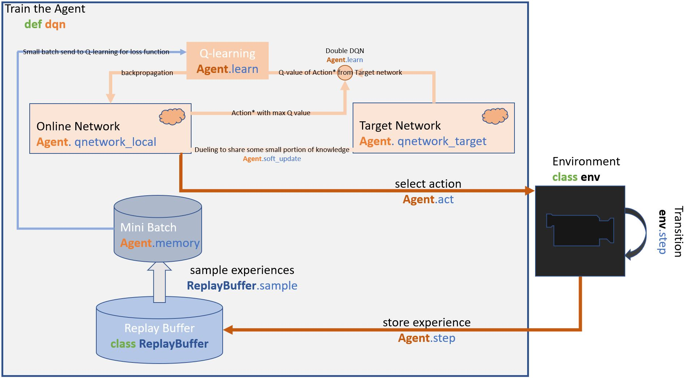
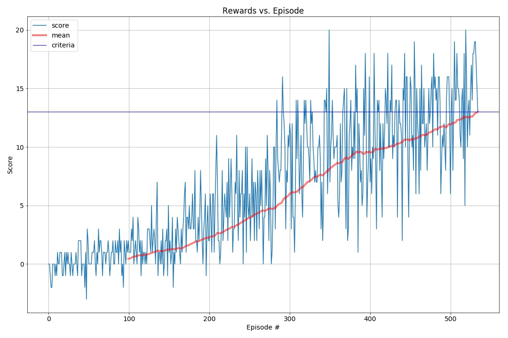

# Summary:

In this report, I will go through my learning algorithms and the training results for this project.

## Learning Algorithm:

The source code for this project can be find in Navigation.ipynb. The main algorithms are listed below:

1. Double DQN 
   Based on the course material, I added the double DQN from the basic deep Q-learning. This algorithm helps the agent to stabilize for its neuronetwork. 
2. Experience Replay 
   I created a buffer project that collect data as the agent explore. Later, the agent can use these data to train itself.
3. Huber Loss 
   I used huber loss function to stabilize the training loss function.

Architectures and Parameters:

I used two fully connected layers for the agent's online and target network:

Below is the training parameters:

## Final Result:

The agent took about 535 episodes to reach 13 average score:

## Future Work:

- design more data efficient agent with PER(Prioritized Replay).
- fine tune the agent to get better score

## Trained Model:

[Trained model (DDQN)](model.pth)